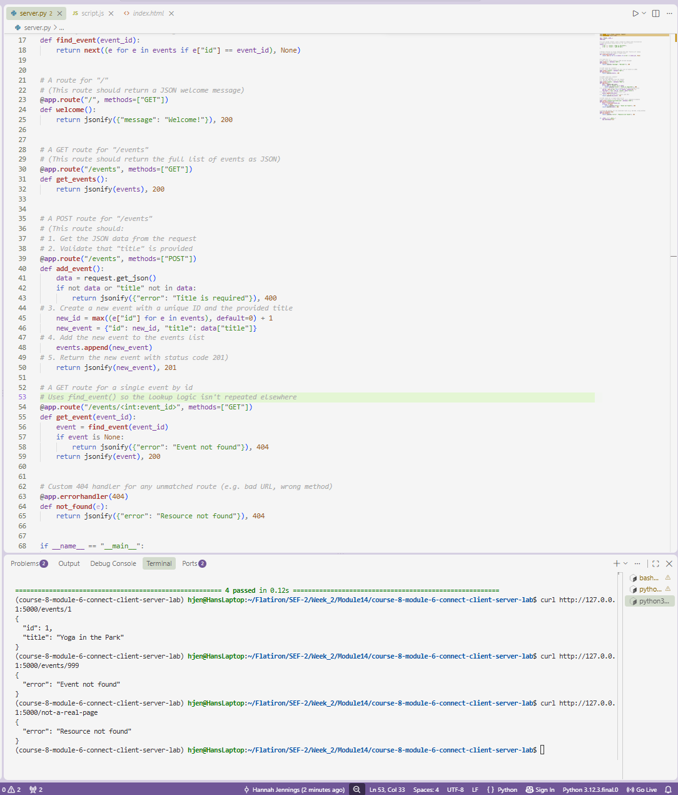

# Client-Server Application - Event Catalog
**Completed Sept 15, 2026**

## Description

This project implements a small full-stack event catalog using a Flask back end and a static HTML/JS front end. The Flask app exposes routes to:

- Return a JSON welcome message (`GET /`)
- Return the full list of stored events (`GET /events`)
- Accept and store a new event, validating that a title is provided (`POST /events`)
- Look up a single event by id (`GET /events/<id>`)
- Return a consistent JSON error for any unmatched route (`404` handler)

The front end fetches events from the API on page load and renders them to the DOM. Submitting the form sends a `POST` request to add a new event and appends it to the page immediately, with no page reload.

## Screenshot



## Installation

1. Clone this repository:
   ```
   git clone <your-fork-url>
   cd course-8-module-6-connect-client-server-lab
   ```
2. Install dependencies:
   ```
   pipenv install
   ```
3. Activate the virtual environment:
   ```
   pipenv shell
   ```

## Usage

Start the Flask server:

```
python server.py
```

Then open `client/index.html` in your browser to view the front end. With the server running, you can also hit the API directly:

```
curl http://127.0.0.1:5000/
curl http://127.0.0.1:5000/events
curl -X POST http://127.0.0.1:5000/events \
  -H "Content-Type: application/json" \
  -d '{"title": "New Event"}'
```

## Testing

Run the test suite with:

```
pytest
```

Tests live in `tests/test_app.py` and verify the welcome message, the events list, successful event creation, and the `400` response when a POST is missing a title.

## Tools and Resources

- [Flask Quickstart](https://flask.palletsprojects.com/en/latest/quickstart/)
- [Flask-CORS](https://flask-cors.readthedocs.io/en/latest/)
- [MDN: Fetch API](https://developer.mozilla.org/en-US/docs/Web/API/Fetch_API)
- [MDN: HTTP methods](https://developer.mozilla.org/en-US/docs/Web/HTTP/Methods)

## Grading Criteria

The application passes all test suites:
- Homepage returns a welcome message
- `GET /events` returns the event list
- `POST /events` creates a new event and returns `201`
- `POST /events` returns `400` when the title is missing